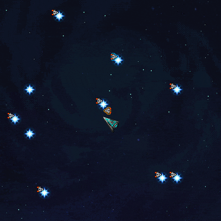

  

## Documentation

All our code is documented in English and can be reviewed [here](https://people.uta.fi/~he96338/GalaxyQuestDocs/)!

Feedback we received from the teacher can be viewed [here](readme/feedback.txt) (in Finnish)

## Introduction

 

Galaxy quest is a simple point-n-click type of game with a retro look and feel. It was written in 3 weeks and 3 days with C++ and QT as a part of Programming techniques course. Our job was to program the game logic, player functionality, unit tests for one class, graphical user interface and graphical representations of the game objects, while course assistants provided the space ship functionality for the game.

Unfortunately this repository does not contain entire project, and you wont be able to compile the game, as we can only share code made by ourselves. You can use this repository for learning purposes. 

**Notes:**
- This repository does not include the original git commit history.

## Course information

- Programming techniques, 5 op
  - Fall 2017, Tampere University of Technology
  - [Course information](http://www.tut.fi/opinto-opas/wwwoppaat/opas2017-2018/perus/aineryhmat/Ohjelmistotekniikka/TIE-02401.html) (in Finnish)

